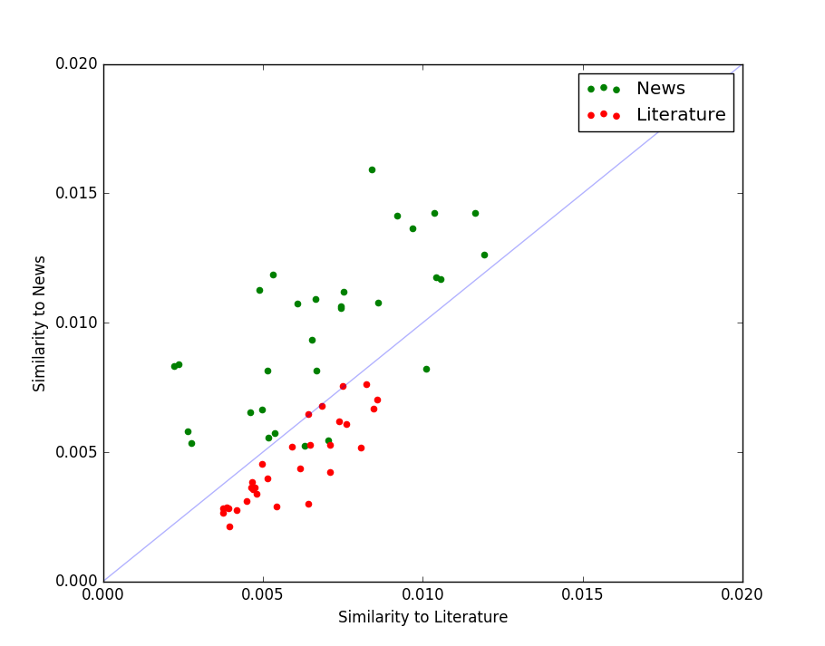

# Document-Class-detection

With the increase of digitalization of documents, the organization and maintenance of textual data becomes important, especially in the form of relevance, context and inter-connection.  It can also help determine meaning to offer more concrete results. Every document is written in a particular style of language based on which domain experts can classify them into classes or categories such as news, literature, reviews, forums and chats etc., thus allowing the perception of context in which that particular document is written. This report explains and provides a proof of concept to classify documents based on the context in which the words in the document are used. Different corpora belonging to different contextual domains
are accumulated and the feature vectors of the words, collectively called an embedding for a document, are learned. A model called Word2vec is used to produce word embeddings from the text which provides contextual information about the words present in the text.
The aim is to classify documents based on the context in which each word is used. The rationale behind this is, the context in which one particular word is used in different classes of documents is different. The model used is supervised as the document classes are provided while training the data from the raw text. Once the model is built, similarity measures are calculated in order to classify an input text. Usually text classiffcation, in general, involves identifying semantics in the text which depends on the context. 

## Getting Started
* Get the code file.
* Change the baseclass filenames.
* Run.

## Running the tests
* Create two text files that will serve as the base classes.
* Find relevant test files and place them in folder 'Test' within the same directory.

## Built With
* [Gensim](https://radimrehurek.com/gensim/install.html) -  The Word2vec package of Gensim.
* [NLTK](http://www.nltk.org/install.html)- Using the stopwords corpus to remove the stop words.
* Matplotlib - To plot the test points.